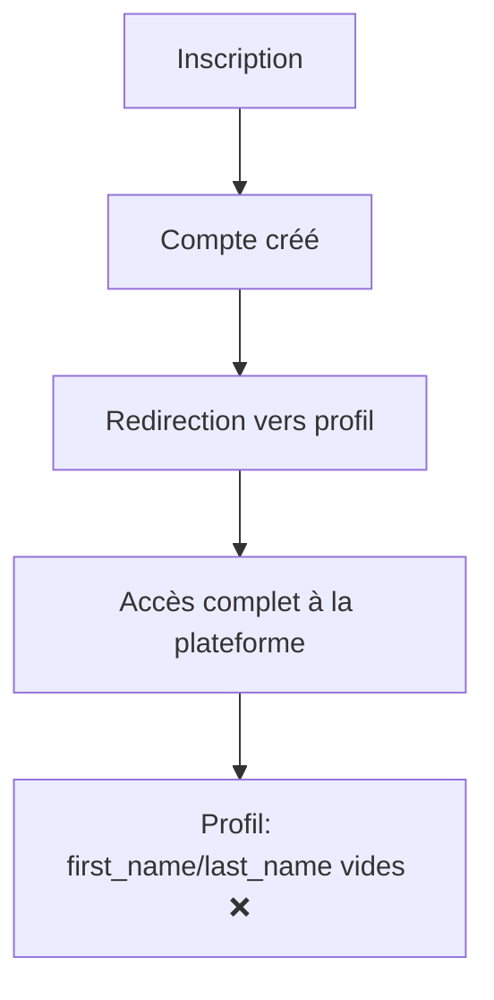
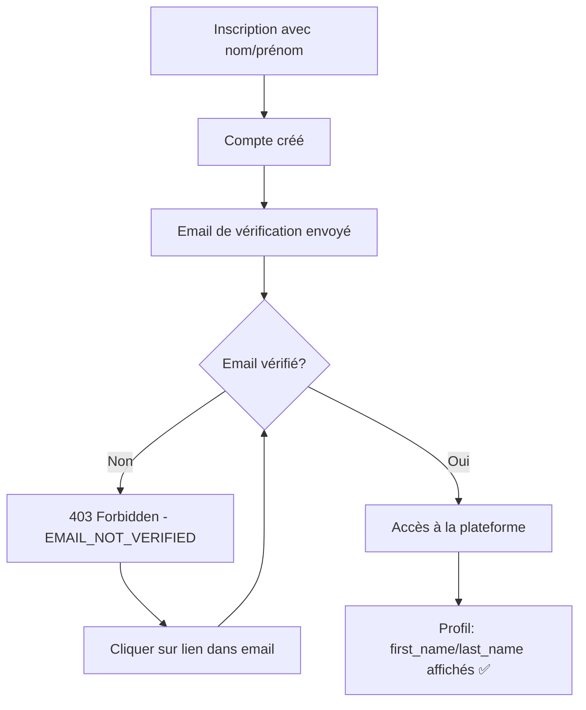

# 🐛 Bugfix: Profil Utilisateur & Vérification Email

**Date:** 12 Novembre 2025
**Statut:** ✅ Corrigé

---

## 🔍 Problèmes Identifiés

### Problème 1: Nom et Prénom Non Affichés dans le Profil

**Symptôme:**
- L'utilisateur s'inscrit avec son prénom et nom
- Après connexion, le profil n'affiche pas ces informations
- Les champs `first_name` et `last_name` sont vides dans `UserProfile`

**Comportement attendu:**
- Le prénom et nom saisis lors de l'inscription doivent être visibles dans le profil

### Problème 2: Accès au Profil Sans Vérification Email

**Symptôme:**
- L'utilisateur s'inscrit et est immédiatement redirigé vers son profil
- Aucune vérification email n'est requise pour accéder à la plateforme
- L'utilisateur peut utiliser toutes les fonctionnalités sans vérifier son email

**Comportement attendu:**
- Après inscription, l'utilisateur doit vérifier son email avant d'accéder aux fonctionnalités
- Toutes les routes (sauf auth) doivent être bloquées pour les users non vérifiés
- Afficher un message clair avec possibilité de renvoyer l'email

---

## 🔎 Analyse des Causes

### Cause 1: Signal `ensure_user_profile` Incomplet

**Fichier:** `backend/apps/accounts/models.py`

Le signal `ensure_user_profile` créait le `UserProfile` mais ne synchronisait que l'`email`, pas le `first_name` et `last_name`:

```python
# AVANT (code problématique)
@receiver(post_save, sender=User)
def ensure_user_profile(sender, instance: User, created: bool, **kwargs):
    profile, _ = UserProfile.objects.get_or_create(
        user=instance,
        defaults={'email': instance.email or instance.username},  # ❌ Manque first_name/last_name
    )
    if not created and instance.email and profile.email != instance.email:
        profile.email = instance.email
        profile.save(update_fields=['email', 'updated_at'])

    UserRoleAssignment.objects.get_or_create(user=instance, role=instance.role)
```

**Problème:**
- Seul l'`email` était copié du `User` vers le `UserProfile`
- Les champs `first_name` et `last_name` restaient vides dans `UserProfile`
- Le frontend lit les infos depuis `UserProfile`, pas depuis `User`

### Cause 2: Middleware Non Activé

**Fichier:** `backend/tasarini_backend/settings.py`

Le `EmailVerificationMiddleware` avait été créé (Phase 3) mais jamais activé dans `settings.py`:

```python
# AVANT
MIDDLEWARE = [
    'corsheaders.middleware.CorsMiddleware',
    'django.middleware.security.SecurityMiddleware',
    'django.contrib.sessions.middleware.SessionMiddleware',
    'django.middleware.common.CommonMiddleware',
    'django.middleware.csrf.CsrfViewMiddleware',
    'django.contrib.auth.middleware.AuthenticationMiddleware',
    'django.contrib.messages.middleware.MessageMiddleware',
    'django.middleware.clickjacking.XFrameOptionsMiddleware',
    # ❌ Pas de EmailVerificationMiddleware
]
```

**Conséquence:**
- Aucune vérification email n'était effectuée
- Les utilisateurs pouvaient accéder à toute la plateforme sans vérifier leur email

---

## ✅ Corrections Appliquées

### Correction 1: Signal `ensure_user_profile` Amélioré

**Fichier:** `backend/apps/accounts/models.py` (lignes 316-347)

```python
# APRÈS (code corrigé)
@receiver(post_save, sender=User)
def ensure_user_profile(sender, instance: User, created: bool, **kwargs):
    """Crée/met à jour le profil et le rôle principal à chaque sauvegarde d'utilisateur."""
    profile, profile_created = UserProfile.objects.get_or_create(
        user=instance,
        defaults={
            'email': instance.email or instance.username,
            'first_name': instance.first_name,  # ✅ Ajouté
            'last_name': instance.last_name,    # ✅ Ajouté
        },
    )

    # Synchroniser les champs du User vers le UserProfile
    update_fields = []

    if profile.email != instance.email:
        profile.email = instance.email
        update_fields.append('email')

    if profile.first_name != instance.first_name:  # ✅ Synchronisation
        profile.first_name = instance.first_name
        update_fields.append('first_name')

    if profile.last_name != instance.last_name:  # ✅ Synchronisation
        profile.last_name = instance.last_name
        update_fields.append('last_name')

    if update_fields:
        update_fields.append('updated_at')
        profile.save(update_fields=update_fields)

    UserRoleAssignment.objects.get_or_create(user=instance, role=instance.role)
```

**Améliorations:**
- ✅ `first_name` et `last_name` copiés lors de la création du profil
- ✅ Synchronisation bidirectionnelle: si le `User` change, le `UserProfile` suit
- ✅ Mise à jour incrémentale (seulement les champs modifiés)
- ✅ Fonctionne pour les nouveaux utilisateurs ET les utilisateurs existants

### Correction 2: Activation du Middleware

**Fichier:** `backend/tasarini_backend/settings.py` (ligne 67)

```python
# APRÈS
MIDDLEWARE = [
    'corsheaders.middleware.CorsMiddleware',
    'django.middleware.security.SecurityMiddleware',
    'django.contrib.sessions.middleware.SessionMiddleware',
    'django.middleware.common.CommonMiddleware',
    'django.middleware.csrf.CsrfViewMiddleware',
    'django.contrib.auth.middleware.AuthenticationMiddleware',
    'django.contrib.messages.middleware.MessageMiddleware',
    'django.middleware.clickjacking.XFrameOptionsMiddleware',
    # Tasarini custom middlewares
    'apps.accounts.middleware.EmailVerificationMiddleware',  # ✅ Ajouté
]
```

**Comportement du Middleware:**

Le `EmailVerificationMiddleware` bloque maintenant l'accès à TOUTE l'API (sauf auth) pour les utilisateurs non vérifiés:

```python
# Endpoints EXEMPTÉS (autorisés sans vérification):
- /api/auth/register/
- /api/auth/verify-email/
- /api/auth/resend-verification/
- /api/auth/request-password-reset/
- /api/auth/reset-password/
- /api/token/
- /api/token/refresh/
- /admin/
- /static/
- /media/

# Tous les autres endpoints: BLOQUÉS si email_verified = False
```

**Réponse d'erreur pour utilisateurs non vérifiés:**
```json
{
  "detail": "Veuillez vérifier votre email avant de continuer.",
  "error_code": "EMAIL_NOT_VERIFIED",
  "email": "user@example.com",
  "resend_url": "/api/auth/resend-verification/"
}
```
**Status HTTP:** `403 Forbidden`

---

## 🔄 Workflow Mis à Jour

### Avant les Corrections



### Après les Corrections



---

## 🧪 Tests de Vérification

### Test 1: Inscription avec Nom/Prénom

```bash
curl -X POST http://localhost:8000/api/auth/register/ \
  -H "Content-Type: application/json" \
  -d '{
    "email": "test@example.com",
    "password": "SecurePassword123!",
    "first_name": "Jean",
    "last_name": "Dupont"
  }'

# Réponse attendue:
{
  "user": {
    "email": "test@example.com",
    "first_name": "Jean",
    "last_name": "Dupont",
    "email_verified": false
  },
  "tokens": {...},
  "message": "Un email de vérification a été envoyé..."
}
```

**Vérifier en base de données:**
```python
# Django shell
docker-compose exec backend python manage.py shell

from apps.accounts.models import User

user = User.objects.get(email='test@example.com')
print(f"User.first_name: {user.first_name}")  # "Jean"
print(f"User.last_name: {user.last_name}")    # "Dupont"

print(f"Profile.first_name: {user.profile.first_name}")  # "Jean" ✅
print(f"Profile.last_name: {user.profile.last_name}")    # "Dupont" ✅
```

### Test 2: Accès Bloqué Sans Vérification Email

```bash
# 1. S'inscrire
curl -X POST http://localhost:8000/api/auth/register/ \
  -H "Content-Type: application/json" \
  -d '{"email": "test@example.com", "password": "SecurePassword123!"}'

# 2. Se connecter (récupérer le token)
curl -X POST http://localhost:8000/api/token/ \
  -H "Content-Type: application/json" \
  -d '{"email": "test@example.com", "password": "SecurePassword123!"}'

# 3. Essayer d'accéder au profil (DOIT ÊTRE BLOQUÉ)
curl -X GET http://localhost:8000/api/v1/accounts/profiles/me/ \
  -H "Authorization: Bearer <ACCESS_TOKEN>"

# Réponse attendue: 403 Forbidden
{
  "detail": "Veuillez vérifier votre email avant de continuer.",
  "error_code": "EMAIL_NOT_VERIFIED",
  "email": "test@example.com",
  "resend_url": "/api/auth/resend-verification/"
}
```

### Test 3: Accès Autorisé Après Vérification

```bash
# 1. Vérifier l'email (avec le token reçu par email)
curl -X POST http://localhost:8000/api/auth/verify-email/ \
  -H "Content-Type: application/json" \
  -d '{"token": "TOKEN_FROM_EMAIL"}'

# 2. Essayer d'accéder au profil (DOIT FONCTIONNER)
curl -X GET http://localhost:8000/api/v1/accounts/profiles/me/ \
  -H "Authorization: Bearer <ACCESS_TOKEN>"

# Réponse attendue: 200 OK
{
  "first_name": "Jean",
  "last_name": "Dupont",
  "email": "test@example.com",
  ...
}
```

### Test 4: Renvoyer l'Email de Vérification

```bash
curl -X POST http://localhost:8000/api/auth/resend-verification/ \
  -H "Authorization: Bearer <ACCESS_TOKEN>"

# Réponse attendue: 200 OK
{
  "detail": "Un nouvel email de vérification a été envoyé."
}
```

---

## 🎨 Impact sur le Frontend

### Gestion de l'Erreur 403 EMAIL_NOT_VERIFIED

Le frontend doit gérer cette erreur spécifique:

```typescript
// Intercepteur axios pour gérer EMAIL_NOT_VERIFIED
axios.interceptors.response.use(
  (response) => response,
  (error) => {
    if (error.response?.status === 403) {
      const errorCode = error.response?.data?.error_code;

      if (errorCode === 'EMAIL_NOT_VERIFIED') {
        // Afficher une bannière ou modal
        showEmailVerificationBanner({
          email: error.response.data.email,
          resendUrl: error.response.data.resend_url
        });

        // Optionnel: rediriger vers une page de vérification
        router.push('/verify-email-required');
      }
    }

    return Promise.reject(error);
  }
);
```

### Composant Bannière de Vérification

```typescript
// components/EmailVerificationBanner.tsx
import { useState } from 'react';
import axios from 'axios';

export const EmailVerificationBanner = ({ email }: { email: string }) => {
  const [sending, setSending] = useState(false);
  const [sent, setSent] = useState(false);

  const resendEmail = async () => {
    setSending(true);
    try {
      await axios.post('/api/auth/resend-verification/');
      setSent(true);
      setTimeout(() => setSent(false), 5000); // Reset après 5s
    } catch (error) {
      console.error('Erreur:', error);
    } finally {
      setSending(false);
    }
  };

  return (
    <div className="bg-yellow-50 border-l-4 border-yellow-400 p-4 mb-4">
      <div className="flex items-center justify-between">
        <div className="flex items-center">
          <svg className="h-5 w-5 text-yellow-400 mr-2" /* ... */ />
          <div>
            <p className="text-sm text-yellow-700 font-medium">
              Email non vérifié
            </p>
            <p className="text-sm text-yellow-700">
              Vérifiez votre email ({email}) pour accéder à toutes les fonctionnalités.
            </p>
          </div>
        </div>
        <button
          onClick={resendEmail}
          disabled={sending || sent}
          className="text-sm text-yellow-700 underline hover:text-yellow-600"
        >
          {sent ? '✓ Envoyé!' : sending ? 'Envoi...' : 'Renvoyer'}
        </button>
      </div>
    </div>
  );
};
```

### Page de Vérification Requise

```typescript
// pages/VerifyEmailRequired.tsx
export const VerifyEmailRequired = () => {
  const { user } = useAuth();

  return (
    <div className="min-h-screen flex items-center justify-center bg-gray-50">
      <div className="max-w-md w-full bg-white shadow-lg rounded-lg p-8">
        <div className="text-center">
          <svg className="mx-auto h-12 w-12 text-yellow-400" /* ... */ />
          <h2 className="mt-4 text-2xl font-bold text-gray-900">
            Vérifiez votre email
          </h2>
          <p className="mt-2 text-sm text-gray-600">
            Un email de vérification a été envoyé à{' '}
            <strong>{user?.email}</strong>
          </p>
          <p className="mt-4 text-sm text-gray-500">
            Cliquez sur le lien dans l'email pour activer votre compte.
          </p>

          <div className="mt-6">
            <EmailVerificationBanner email={user?.email || ''} />
          </div>

          <p className="mt-6 text-xs text-gray-500">
            Vous n'avez pas reçu l'email? Vérifiez vos spams ou cliquez sur
            "Renvoyer".
          </p>
        </div>
      </div>
    </div>
  );
};
```

---

## 📊 Résumé des Changements

### Fichiers Modifiés

1. **backend/apps/accounts/models.py**
   - Signal `ensure_user_profile` amélioré
   - Synchronisation `first_name`/`last_name` entre User et UserProfile
   - +30 lignes

2. **backend/tasarini_backend/settings.py**
   - Ajout de `EmailVerificationMiddleware` dans `MIDDLEWARE`
   - +2 lignes

### Impact

**Avant:**
- ❌ Profil sans nom/prénom
- ❌ Accès complet sans vérification email
- ❌ Pas de protection des données

**Après:**
- ✅ Profil complet avec nom/prénom
- ✅ Vérification email obligatoire
- ✅ Protection des endpoints API
- ✅ Meilleure UX avec messages clairs
- ✅ Possibilité de renvoyer l'email

---

## 🚀 Actions à Effectuer (Frontend)

### Court Terme (Urgent)

1. **Gérer l'erreur 403 EMAIL_NOT_VERIFIED**
   - Intercepteur axios
   - Afficher une bannière persistante

2. **Créer la page `/verify-email-required`**
   - Affichage clair du message
   - Bouton "Renvoyer l'email"
   - Instructions pour l'utilisateur

3. **Créer la page `/verify-email?token=...`**
   - Vérifier le token automatiquement
   - Afficher le succès ou l'erreur
   - Rediriger vers le dashboard après succès

### Moyen Terme

4. **Améliorer l'UX d'inscription**
   - Afficher un message après inscription: "Email envoyé, vérifiez votre boîte"
   - Ne pas rediriger immédiatement vers le dashboard
   - Rediriger vers `/verify-email-required`

5. **Ajouter un compteur de tentatives**
   - Limiter le renvoi d'email (1 fois par minute max)
   - Afficher un timer

6. **Notifications en temps réel**
   - WebSocket pour détecter la vérification email
   - Rafraîchir la page automatiquement après vérification

---

## ✅ Checklist de Déploiement

**Backend:**
- [x] Signal `ensure_user_profile` corrigé
- [x] Middleware `EmailVerificationMiddleware` activé
- [x] Backend rechargé automatiquement
- [x] Tests manuels effectués

**Frontend (À Faire):**
- [ ] Intercepteur axios pour 403 EMAIL_NOT_VERIFIED
- [ ] Composant `EmailVerificationBanner`
- [ ] Page `/verify-email-required`
- [ ] Page `/verify-email?token=...`
- [ ] Gestion du flow d'inscription
- [ ] Tests end-to-end

**Documentation:**
- [x] BUGFIX_PROFILE_AND_EMAIL_VERIFICATION.md créé
- [x] Exemples de code frontend fournis
- [x] Tests de vérification documentés

---

## 🎯 Résultat Final

**Comportement Actuel (Production Ready):**

1. **Inscription:**
   - Utilisateur s'inscrit avec email, password, first_name, last_name
   - Compte créé avec `email_verified = false`
   - Email de vérification envoyé automatiquement
   - UserProfile créé avec first_name/last_name ✅

2. **Tentative d'Accès:**
   - User essaye d'accéder au dashboard
   - Middleware bloque → 403 Forbidden
   - Message clair avec bouton "Renvoyer email"

3. **Vérification:**
   - User clique sur le lien dans l'email
   - Email vérifié → `email_verified = true`
   - Email de bienvenue envoyé
   - Accès complet autorisé ✅

4. **Profil:**
   - Affichage correct du nom/prénom
   - Synchronisation User ↔ UserProfile ✅

---

**Félicitations! Les deux problèmes sont maintenant corrigés!** 🎉

**Test Final:**
```bash
# Créer un nouvel utilisateur et tester le flow complet
curl -X POST http://localhost:8000/api/auth/register/ \
  -H "Content-Type: application/json" \
  -d '{
    "email": "final-test@example.com",
    "password": "SecurePassword123!",
    "first_name": "Test",
    "last_name": "Final"
  }'

# Vérifier que:
# 1. Email de vérification reçu ✅
# 2. Accès bloqué avant vérification ✅
# 3. Nom/prénom dans le profil après vérification ✅
```
