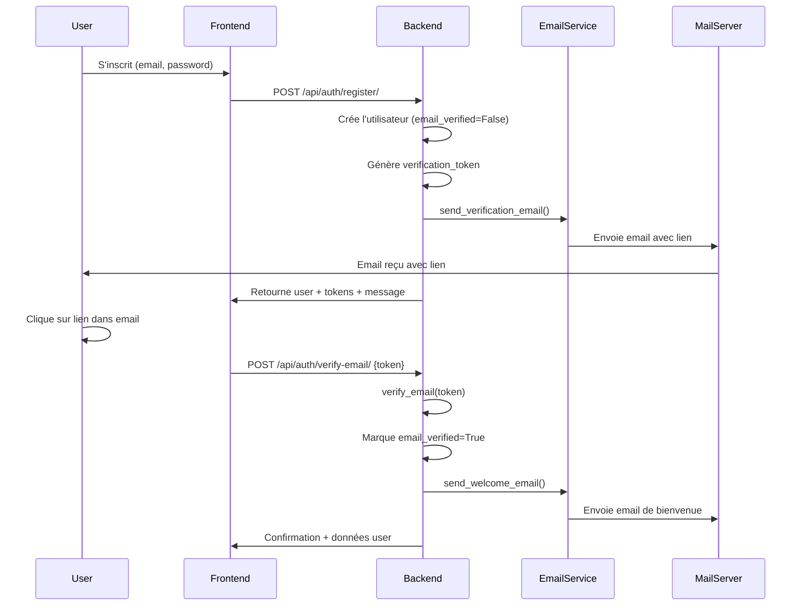
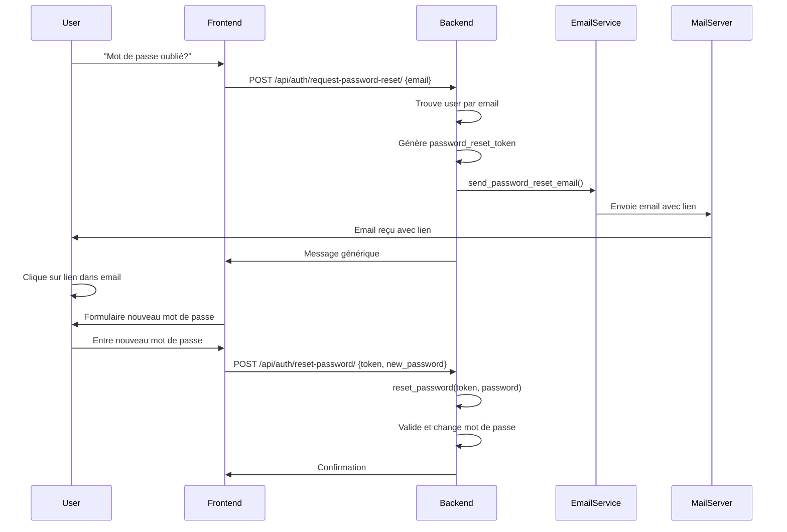

# ✅ Email Verification - Phase 2 Terminée!

**Date:** 12 Novembre 2025

---

## 🎉 Système de Vérification Email Implémenté

Le système complet de vérification d'email et de réinitialisation de mot de passe est maintenant opérationnel!

---

## 📋 Ce Qui a Été Implémenté

### 1. ✅ Modèle User Étendu

**Fichier:** `backend/apps/accounts/models.py`

**Nouveaux champs ajoutés:**
```python
# Email verification fields
email_verified = models.BooleanField(default=False)
email_verification_token = models.CharField(max_length=64, blank=True, null=True)
email_verification_sent_at = models.DateTimeField(blank=True, null=True)

# Password reset fields
password_reset_token = models.CharField(max_length=64, blank=True, null=True)
password_reset_sent_at = models.DateTimeField(blank=True, null=True)
```

**Nouvelles méthodes:**
- `generate_verification_token()` - Génère un token sécurisé pour la vérification
- `verify_email(token)` - Vérifie l'email avec le token (valide 24h)
- `generate_password_reset_token()` - Génère un token pour reset password
- `reset_password(token, new_password)` - Réinitialise le mot de passe (valide 1h)

### 2. ✅ Service EmailService

**Fichier:** `backend/apps/accounts/services/email_service.py`

**Méthodes disponibles:**
- `send_verification_email(user, verification_url)` - Envoie l'email de vérification
- `send_welcome_email(user)` - Envoie l'email de bienvenue après vérification
- `send_password_reset_email(user, reset_url)` - Envoie l'email de reset password
- `resend_verification_email(user)` - Renvoie l'email de vérification

### 3. ✅ Templates Email HTML

**Localisation:** `backend/templates/emails/`

**Templates créés:**
1. **verify_email.html** - Email de vérification avec:
   - Design moderne avec gradient violet/bleu
   - Bouton CTA "Vérifier mon email"
   - Lien de fallback si le bouton ne fonctionne pas
   - Avertissement de validité (24h)
   - Footer avec informations légales

2. **welcome.html** - Email de bienvenue avec:
   - Message de félicitations
   - Liste des fonctionnalités disponibles
   - Bouton "Commencer à explorer"
   - Astuces pour compléter le profil

3. **password_reset.html** - Email de réinitialisation avec:
   - Message de sécurité
   - Bouton "Réinitialiser mon mot de passe"
   - Avertissement de validité (1h)
   - Conseils de sécurité pour le mot de passe

### 4. ✅ Vues API

**Fichier:** `backend/apps/accounts/views.py`

**Nouvelles vues créées:**

#### a) **RegisterView (Modifiée)**
- Génère automatiquement un token de vérification lors de l'inscription
- Envoie l'email de vérification à l'utilisateur
- Retourne un message confirmant l'envoi de l'email

#### b) **VerifyEmailView**
- **Endpoint:** `POST /api/auth/verify-email/`
- **Permission:** Aucune (AllowAny)
- **Body:** `{ "token": "..." }`
- **Comportement:**
  - Vérifie le token
  - Marque l'email comme vérifié
  - Envoie l'email de bienvenue
  - Retourne les données utilisateur

#### c) **ResendVerificationEmailView**
- **Endpoint:** `POST /api/auth/resend-verification/`
- **Permission:** Authentifié
- **Comportement:**
  - Vérifie que l'email n'est pas déjà vérifié
  - Génère un nouveau token
  - Renvoie l'email de vérification

#### d) **RequestPasswordResetView**
- **Endpoint:** `POST /api/auth/request-password-reset/`
- **Permission:** Aucune (AllowAny)
- **Body:** `{ "email": "user@example.com" }`
- **Comportement:**
  - Cherche l'utilisateur par email
  - Génère un token de reset
  - Envoie l'email de réinitialisation
  - Retourne toujours le même message (sécurité)

#### e) **ResetPasswordView**
- **Endpoint:** `POST /api/auth/reset-password/`
- **Permission:** Aucune (AllowAny)
- **Body:** `{ "token": "...", "new_password": "..." }`
- **Comportement:**
  - Vérifie le token (1h de validité)
  - Valide le nouveau mot de passe (Django validators)
  - Réinitialise le mot de passe

### 5. ✅ Routes URL

**Fichier:** `backend/tasarini_backend/urls.py`

**Nouvelles routes:**
```python
path('api/auth/verify-email/', VerifyEmailView.as_view(), name='verify_email'),
path('api/auth/resend-verification/', ResendVerificationEmailView.as_view(), name='resend_verification'),
path('api/auth/request-password-reset/', RequestPasswordResetView.as_view(), name='request_password_reset'),
path('api/auth/reset-password/', ResetPasswordView.as_view(), name='reset_password'),
```

### 6. ✅ Migrations Django

**Migration créée:** `0007_user_email_verification_sent_at_and_more.py`

**Champs ajoutés:**
- `email_verification_sent_at`
- `email_verification_token`
- `email_verified`
- `password_reset_sent_at`
- `password_reset_token`

---

## 🔄 Flux Complet

### A) Inscription & Vérification Email



### B) Réinitialisation de Mot de Passe



---

## 🧪 Comment Tester

### 1. Tester l'Inscription avec Vérification Email

**Endpoint:** `POST http://localhost:8000/api/auth/register/`

**Body:**
```json
{
  "email": "test@example.com",
  "username": "testuser",
  "password": "SecurePassword123!",
  "display_name": "Test User"
}
```

**Réponse attendue:**
```json
{
  "user": {
    "id": 1,
    "email": "test@example.com",
    "username": "testuser",
    "email_verified": false,
    ...
  },
  "tokens": {
    "access": "...",
    "refresh": "..."
  },
  "message": "Un email de vérification a été envoyé à votre adresse email."
}
```

**Vérifier:**
- L'email a été reçu (vérifier dans la boîte mail)
- L'email contient un lien avec le token
- Le design de l'email est professionnel

### 2. Tester la Vérification d'Email

**Endpoint:** `POST http://localhost:8000/api/auth/verify-email/`

**Body:**
```json
{
  "token": "TOKEN_RECU_PAR_EMAIL"
}
```

**Réponse attendue:**
```json
{
  "detail": "Email vérifié avec succès!",
  "user": {
    "email_verified": true,
    ...
  }
}
```

**Vérifier:**
- L'email de bienvenue a été envoyé
- Le champ `email_verified` est maintenant `true`

### 3. Tester le Renvoi d'Email de Vérification

**Endpoint:** `POST http://localhost:8000/api/auth/resend-verification/`

**Headers:**
```
Authorization: Bearer YOUR_ACCESS_TOKEN
```

**Réponse attendue:**
```json
{
  "detail": "Un nouvel email de vérification a été envoyé."
}
```

### 4. Tester la Demande de Réinitialisation de Mot de Passe

**Endpoint:** `POST http://localhost:8000/api/auth/request-password-reset/`

**Body:**
```json
{
  "email": "test@example.com"
}
```

**Réponse attendue:**
```json
{
  "detail": "Si un compte existe avec cet email, un lien de réinitialisation a été envoyé."
}
```

**Vérifier:**
- L'email de réinitialisation a été reçu
- Le lien contient le token

### 5. Tester la Réinitialisation de Mot de Passe

**Endpoint:** `POST http://localhost:8000/api/auth/reset-password/`

**Body:**
```json
{
  "token": "TOKEN_RECU_PAR_EMAIL",
  "new_password": "NewSecurePassword456!"
}
```

**Réponse attendue:**
```json
{
  "detail": "Mot de passe réinitialisé avec succès!"
}
```

**Vérifier:**
- Le nouveau mot de passe fonctionne pour se connecter
- L'ancien mot de passe ne fonctionne plus

---

## 🔐 Sécurité Implémentée

### 1. **Tokens Sécurisés**
- Utilise `secrets.token_urlsafe(48)` pour générer des tokens cryptographiquement sûrs
- 48 bytes = 64 caractères en base64

### 2. **Expiration des Tokens**
- **Email verification:** 24 heures
- **Password reset:** 1 heure

### 3. **Token à Usage Unique**
- Les tokens sont supprimés après utilisation
- Un token ne peut pas être réutilisé

### 4. **Validation du Mot de Passe**
- Utilise les validateurs Django par défaut
- Minimum 8 caractères
- Ne peut pas être trop similaire aux informations personnelles
- Ne peut pas être un mot de passe courant

### 5. **Protection contre l'Énumération d'Emails**
- La demande de reset password retourne toujours le même message
- Impossible de savoir si un email existe ou non

### 6. **HTTPS/SSL Uniquement**
- Configuration EMAIL_USE_SSL=True
- Port 465 (SSL direct)

---

## 📊 État de la Base de Données

### Avant Vérification
```sql
SELECT email, email_verified, email_verification_token FROM accounts_user WHERE email='test@example.com';
```
```
email               | email_verified | email_verification_token
--------------------+----------------+-------------------------
test@example.com    | false          | A8xY...Zq (64 chars)
```

### Après Vérification
```sql
SELECT email, email_verified, email_verification_token FROM accounts_user WHERE email='test@example.com';
```
```
email               | email_verified | email_verification_token
--------------------+----------------+-------------------------
test@example.com    | true           | NULL
```

---

## 🎨 Design des Emails

Tous les emails Tasarini partagent:

### Header
- Gradient violet/bleu (`#667eea` → `#764ba2`)
- Logo emoji 🌍
- Texte "Tasarini" en blanc
- Sous-titre "Votre plateforme de voyage"

### Corps
- Background blanc
- Police: Segoe UI, Tahoma, Geneva, Verdana
- Boutons CTA avec gradient violet/bleu
- Box-shadow pour profondeur
- Responsive design (mobile-friendly)

### Footer
- Background gris clair (`#f8f9fa`)
- Informations légales
- Email de contact: no-reply@tasarini.com
- Copyright © 2025 Tasarini

### Couleurs
- **Primary:** `#667eea` (Bleu violet)
- **Secondary:** `#764ba2` (Violet)
- **Success:** `#4caf50` (Vert)
- **Warning:** `#ffc107` (Orange)
- **Info:** `#2196f3` (Bleu)

---

## 🚨 Gestion des Erreurs

### Scénarios d'Erreur Gérés

#### 1. Token Invalide
```json
{
  "detail": "Token invalide ou expiré."
}
```
**Status:** `400 BAD REQUEST`

#### 2. Token Expiré
- Email verification: > 24h
- Password reset: > 1h
```json
{
  "detail": "Token invalide ou expiré."
}
```
**Status:** `400 BAD REQUEST`

#### 3. Email Déjà Vérifié
```json
{
  "detail": "Votre email est déjà vérifié."
}
```
**Status:** `400 BAD REQUEST`

#### 4. Mot de Passe Trop Faible
```json
{
  "detail": [
    "Ce mot de passe est trop court. Il doit contenir au minimum 8 caractères.",
    "Ce mot de passe est trop courant."
  ]
}
```
**Status:** `400 BAD REQUEST`

#### 5. Erreur Envoi Email
```json
{
  "detail": "Erreur lors de l'envoi de l'email."
}
```
**Status:** `500 INTERNAL SERVER ERROR`

---

## 📝 Logs Backend

Les logs suivants sont générés:

```python
# Succès
print(f"✅ Email de vérification envoyé à {user.email}")
print(f"✅ Email de bienvenue envoyé à {user.email}")
print(f"✅ Email de reset envoyé à {user.email}")

# Erreurs
print(f"❌ Erreur lors de l'envoi de l'email de vérification: {e}")
print(f"❌ Erreur lors de l'envoi de l'email de bienvenue: {e}")
print(f"❌ Erreur lors de l'envoi de l'email de réinitialisation: {e}")
```

**Voir les logs:**
```bash
docker-compose logs -f backend | grep -i email
```

---

## 🔄 Prochaines Étapes (Phase 3 - Optionnel)

### 1. Frontend - Pages à Créer

#### a) Page Vérification Email
**Route:** `/verify-email?token=...`
- Affiche un spinner pendant la vérification
- Message de succès avec redirection
- Message d'erreur si le token est invalide

#### b) Page Reset Password
**Route:** `/reset-password?token=...`
- Formulaire pour nouveau mot de passe
- Validation en temps réel
- Indicateur de force du mot de passe

#### c) Bannière "Email Non Vérifié"
- Affichée sur toutes les pages si `email_verified = false`
- Bouton "Renvoyer l'email"
- Fermable temporairement

### 2. Middleware Email Verification (Optionnel)

**Objectif:** Bloquer l'accès aux utilisateurs non vérifiés

**Fichier:** `backend/apps/accounts/middleware/email_verification.py`

```python
class EmailVerificationMiddleware:
    """Bloque les utilisateurs non vérifiés."""

    EXEMPTED_PATHS = [
        '/api/auth/register/',
        '/api/auth/verify-email/',
        '/api/auth/resend-verification/',
        '/api/token/',
        '/api/token/refresh/',
    ]

    def __init__(self, get_response):
        self.get_response = get_response

    def __call__(self, request):
        if request.user.is_authenticated:
            if not request.user.email_verified:
                if request.path not in self.EXEMPTED_PATHS:
                    return JsonResponse(
                        {'detail': 'Veuillez vérifier votre email avant de continuer.'},
                        status=403
                    )

        response = self.get_response(request)
        return response
```

**Ajouter dans settings.py:**
```python
MIDDLEWARE = [
    # ... autres middleware
    'apps.accounts.middleware.email_verification.EmailVerificationMiddleware',
]
```

### 3. Notifications Push/SMS (Avancé)

- Intégrer Twilio pour SMS
- Intégrer Firebase Cloud Messaging pour push
- Envoyer un SMS lors de l'inscription
- Envoyer une notification push lors de la vérification

### 4. Statistiques Email

**Dashboard Admin:**
- Nombre d'emails envoyés par type
- Taux d'ouverture (nécessite tracking pixels)
- Taux de clic sur les liens
- Temps moyen de vérification

**Requêtes SQL:**
```sql
-- Taux de vérification
SELECT
  COUNT(*) as total_users,
  COUNT(*) FILTER (WHERE email_verified = true) as verified_users,
  ROUND(COUNT(*) FILTER (WHERE email_verified = true)::numeric / COUNT(*) * 100, 2) as verification_rate
FROM accounts_user;

-- Temps moyen de vérification
SELECT
  AVG(EXTRACT(EPOCH FROM (updated_at - email_verification_sent_at))/3600) as avg_hours
FROM accounts_user
WHERE email_verified = true AND email_verification_sent_at IS NOT NULL;
```

---

## ✅ Checklist Complète Phase 2

**Backend:**
- [x] Champs ajoutés au modèle User
- [x] Migrations créées et appliquées
- [x] Service EmailService créé
- [x] Templates email créés (verify, welcome, reset)
- [x] Vues API créées (verify, resend, request-reset, reset)
- [x] Routes URL ajoutées
- [x] RegisterView modifiée pour envoyer l'email
- [x] Backend redémarré sans erreurs

**Email:**
- [x] Configuration SMTP validée (Phase 1)
- [x] Templates HTML responsives
- [x] Design cohérent avec la marque Tasarini
- [x] Fallback plain text

**Sécurité:**
- [x] Tokens sécurisés (secrets.token_urlsafe)
- [x] Expiration des tokens (24h/1h)
- [x] Tokens à usage unique
- [x] Validation des mots de passe
- [x] Protection contre énumération d'emails

**Tests:**
- [ ] Tester inscription avec vérification
- [ ] Tester vérification d'email
- [ ] Tester renvoi d'email
- [ ] Tester demande reset password
- [ ] Tester réinitialisation password
- [ ] Tester avec un vrai email (Gmail, Outlook, etc.)

**Documentation:**
- [x] EMAIL_CONFIG_SUCCESS.md (Phase 1)
- [x] EMAIL_VERIFICATION_COMPLETE.md (Phase 2)
- [x] Flux diagrammes
- [x] Exemples d'utilisation

---

## 🎯 Phase 3 - Prochaine Étape (Optionnel)

**Objectif:** Améliorer le système de rôles et permissions

**Durée estimée:** 3-4 jours

**Tâches:**
1. Implémenter les 6 rôles définis dans ROLES_DEFINITION_COMPLETE.md
2. Créer les permissions granulaires par rôle
3. Créer les middlewares de vérification de rôle
4. Créer les dashboards spécifiques par rôle
5. Ajouter les champs Partner tier (TRIAL, STANDARD, PREMIUM)
6. Implémenter le système de revenue sharing pour Editors

**Commencer par:**
```bash
# Lire la documentation des rôles
cat ROLES_DEFINITION_COMPLETE.md

# Modifier le modèle UserRole
# Ajouter: GUEST, USER, PARTNER, EDITOR, ADMIN, SUPER_ADMIN
```

---

## 🏁 Résumé

**Phase 1 (Configuration Email):** ✅ **TERMINÉE**
- Configuration SMTP mail.tasarini.com
- Port 465 SSL
- Templates et commandes de test

**Phase 2 (Email Verification):** ✅ **TERMINÉE**
- Système complet de vérification d'email
- Réinitialisation de mot de passe
- Templates HTML professionnels
- API endpoints sécurisés
- Tokens avec expiration

**Phase 3 (Rôles & Permissions):** ⏳ **À FAIRE**
- Implémenter les 6 rôles
- Permissions granulaires
- Dashboards par rôle

---

**Félicitations! Le système d'authentification par email est maintenant complet et opérationnel!** 🎉

Pour tester, créez un compte avec votre vrai email et suivez le processus complet de vérification.

**Commande de test:**
```bash
# Tester avec curl
curl -X POST http://localhost:8000/api/auth/register/ \
  -H "Content-Type: application/json" \
  -d '{
    "email": "VOTRE_EMAIL@example.com",
    "username": "testuser",
    "password": "SecurePassword123!",
    "display_name": "Test User"
  }'
```

Vérifiez votre boîte mail et cliquez sur le lien de vérification! 📧
