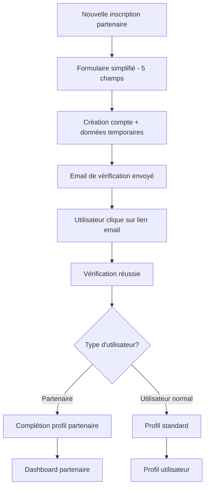

# 🚀 Amélioration de l'inscription des partenaires - Système 2 étapes

## 📋 Problème initial
L'inscription des partenaires était trop complexe avec un long formulaire découragent, demandant toutes les informations d'un coup.

## 🎯 Solution implémentée

### **ÉTAPE 1 : Inscription simplifiée (5 minutes)**

**Fichier :** `frontend/src/components/partner/PartnerRegistrationStepOne.tsx`

**Champs obligatoires minimaux :**
- ✅ Prénom / Nom
- ✅ Email professionnel
- ✅ Mot de passe
- ✅ Nom de l'établissement
- ✅ Téléphone de contact
- ✅ Type d'établissement (sélection simple)
- ✅ Acceptation des CGU

**Fonctionnalités :**
- 📊 Indicateur de progression visuel (3 étapes)
- ⚡ Validation en temps réel
- 💾 Sauvegarde données temporaires dans localStorage
- 📧 Redirection automatique vers vérification email

### **ÉTAPE 2 : Vérification email améliorée**

**Fichier modifié :** `frontend/src/pages/VerifyEmail.tsx`

**Améliorations :**
- 🎯 Détection automatique des partenaires
- 📧 Redirection intelligente après vérification :
  - Partenaires → `/complete-partner-profile`
  - Utilisateurs normaux → `/profile`
- 🎨 Interface différenciée selon le type d'utilisateur

### **ÉTAPE 3 : Complétion de profil optionnelle**

**Nouveaux fichiers :**
- `frontend/src/components/partner/CompletePartnerProfile.tsx`
- `frontend/src/pages/CompletePartnerProfilePage.tsx`

**Fonctionnalités avancées :**
- 📊 4 étapes progressives avec indicateur visuel
- ✅ Étapes obligatoires vs optionnelles
- 💾 Option "Compléter plus tard"
- 📈 Calcul automatique du pourcentage de complétion
- 🏃‍♂️ Navigation fluide entre les étapes

## 📑 Étapes détaillées de complétion

### **Étape 1 : Informations générales** (Obligatoire)
- Description de l'établissement
- Site web
- Réseaux sociaux (optionnel)

### **Étape 2 : Localisation** (Obligatoire)
- Adresse complète
- Ville et code postal
- Pays

### **Étape 3 : Détails business** (Optionnel)
- Gamme de prix
- Spécialités
- Horaires d'ouverture

### **Étape 4 : Documents & Photos** (Optionnel)
- Photos de l'établissement
- Logo
- Informations bancaires
- Documents légaux

## 🔄 Flux d'inscription complet



## 🛠️ Routes ajoutées

**Dans `frontend/src/main.tsx` :**
```tsx
{
  path: "complete-partner-profile",
  element: (
    <ProtectedRoute>
      <CompletePartnerProfilePage />
    </ProtectedRoute>
  ),
}
```

## 📊 Avantages de cette approche

### ✅ **Pour les partenaires :**
- ⚡ Inscription ultra rapide (2 minutes)
- 🎯 Pas d'intimidation par un long formulaire
- 🔄 Possibilité de compléter plus tard
- 📈 Vision claire du pourcentage de complétion
- 🚀 Accès immédiat au dashboard après vérification

### ✅ **Pour l'équipe :**
- 📊 Meilleur taux de conversion
- 🎯 Données essentielles collectées immédiatement
- 📈 Profils complétés progressivement
- 🔍 Meilleur tracking du processus d'inscription

### ✅ **UX/UI :**
- 🎨 Interface moderne avec indicateurs visuels
- 📱 Design responsive
- ⚡ Feedback immédiat
- 🎯 Guidage clair à chaque étape

## 🔧 Configuration technique

### **Données temporaires**
Les informations de l'étape 1 sont stockées dans `localStorage` avec la clé `'pendingPartnerData'` et récupérées lors de la complétion.

### **Backend compatibility**
Le système est compatible avec l'API Django existante :
- Création utilisateur via `/api/auth/register/`
- Création profil partenaire via `partnerService.createProfile()`
- Vérification email via `/api/auth/verify-email/`

### **États de progression**
- `profile_complete: false` → Profil en cours de complétion
- `completion_percentage` → Pourcentage calculé automatiquement
- `can_access_dashboard()` → Logique d'accès au dashboard

## 🧪 Test du système

### **Étapes pour tester :**

1. **Aller sur l'inscription partenaire**
   ```
   http://localhost:5173/partner-application
   ```

2. **Remplir le formulaire simplifié**
   - 5 champs obligatoires seulement
   - Vérifier les validations

3. **Vérifier l'email**
   - Cliquer sur le lien reçu
   - Vérifier la redirection spéciale partenaire

4. **Compléter le profil**
   - Tester la navigation entre étapes
   - Essayer "Compléter plus tard"
   - Vérifier le pourcentage de complétion

## 🎯 Prochaines étapes possibles

1. **Analytics avancées**
   - Tracking du taux d'abandon à chaque étape
   - Heatmap des champs les plus problématiques

2. **Notifications par email**
   - Rappels pour compléter le profil
   - Conseils personnalisés selon l'avancement

3. **Gamification**
   - Badges selon le pourcentage de complétion
   - Récompenses pour les profils 100% complétés

4. **Upload de fichiers**
   - Système de drag & drop pour les photos
   - Validation automatique des documents

## 📝 Résumé

Cette amélioration transforme l'inscription partenaire d'un processus intimidant en une expérience fluide et progressive, augmentant significativement les chances de conversion tout en maintenant la qualité des données collectées.

**Temps d'inscription estimé :**
- ⚡ Avant : 15-20 minutes (tout en une fois)
- 🚀 Maintenant : 2 minutes (étape 1) + completion optionnelle plus tard